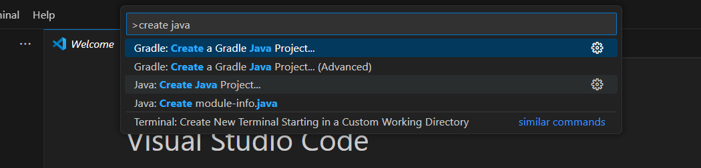
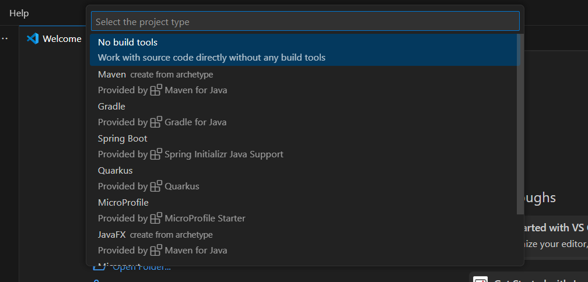
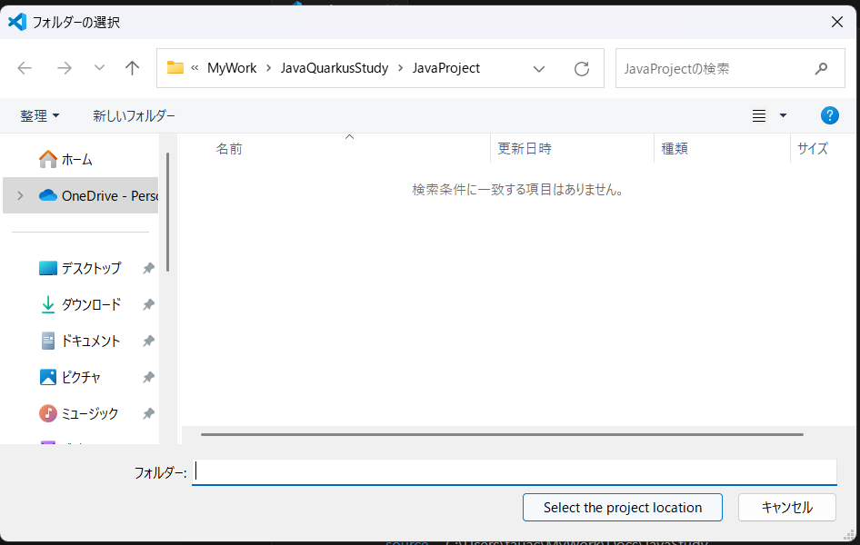
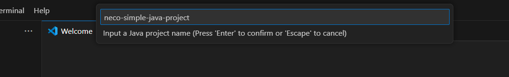

# VSCodeでJavaプログラミングを行う（基礎編）

案件のプロジェクトのような複雑なものではなく  
mainクラスから実行可能な、小さなプロジェクトを作成します。

## 概要

* 前提条件
* プロジェクトの新規作成
* mainの記述・実行

## 詳細

### 前提条件

* JDKのインストール・パスの設定が行われている
* VSCodeがインストールされている
* VSCodeにjava用の拡張機能が導入されている

### プロジェクトの新規作成

* 1. VSCodeを開いて Ctrl+Shift+P > create java projectを入力・選択
* 2. no build toolを選択（起動ボタンから実行するための設定）
* 3. プロジェクトの作成位置を選ぶ
* 4. プロジェクト名を設定する（今回は「neco-simple-java-project」）

|①|②|
|---|---|
|||
|③|④|
|||


### mainメソッドの記述・実行

* 1. src/App.javaにmainクラスがあるので、自由に書き換える
* 2. 左上にある実行ボタンを押すと起動できる
* 3. 後は自由に設計・実装して試してみる


```{note}
上記プロジェクトはリポジトリにPushしてあるので、自由にPullして使ってください。
```