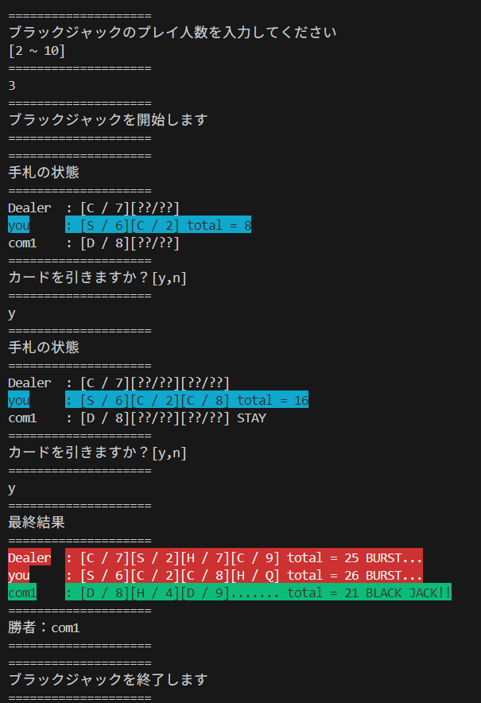

# ①全体の流れとデモ

## 完成形のデモ
### つくったものの説明

  * 今回は、Javaでブラックジャックを作った

### ブラックジャックのルール（高田ルール）

  * トランプ（ジョーカー無し）を使用する
  * 参加者はディーラー（１人）と子（複数人可）
    * 合計で2~10人とする
  * ゲームの手順
    * トランプの山札をシャッフルする
    * 各参加者に手札として2枚ずつ配る
    * 各参加者は順番にいずれかの行動を行う
      * カードを追加で一枚引く（DRAW）
      * 今の手札でポイントを確定させる（STAY）
    * 全参加者がSTAYとなった場合、ポイントの計算を行う
  * ポイント計算と勝敗
    * A は 1 or 11 、絵札(J Q K)は 10 として扱う
    * その他のカードは表示されている数値通り
    * 手札の合計値が21以下で、かつ最も21に近い参加者が勝利する
    * 21を超えてしまった場合は失格となる

### デモ本番

  * 実際に画面共有して行う
  * 大体は以下の画像の通りの結果になる

## 今後の進め方について
### 流れの概略

  * カードをクラスにしてみる
    * クラス定義とインスタンス作成の復習
    * forループを使ってみる
    * Listを使ってみる
    * Enumって何？
  * 山札をクラスにしてみる
    * クラス間の関連の種類と、UMLの対応(あくまで簡単に)
    * 山札とカードの関連と、初期化方法
  * To Be Continued...

### 注意

  * あくまで上記の流れは目安で
    * 場合に応じて前後しながら進める
  * デモと全く同じものを作ることが目的ではない
    * 設計やアルゴリズムとは関係ないところもある（レイアウトとか色付けとか）
    * とはいえ、拘りたかったら全然それでOK
    * 楽しみましょう
