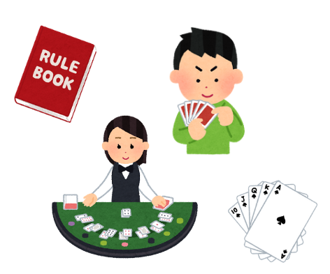
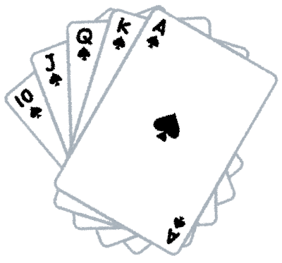

# ①ちいさな範囲で考える

## （序）ブラックジャックをオブジェクト指向でとらえる

  これまでの勉強会では、車や動物、本や人などのオブジェクト（クラス）について考えました  
  それでは、ブラックジャックにはどんなオブジェクトが存在するでしょうか

  例えば...
  * ディーラー
  * プレイヤー
  * トランプ
  
  すべてをオブジェクトの世界で表すなら...　　
  * ゲームのルール
  * ゲーム盤自体

  なんかも、オブジェクトとして扱えそうですね  
  ただ......

  * どこまでオブジェクトにするの？
  * プレイヤーとディーラーって同じ人間だよね
  * プレイヤーって言っても、僕自身とCPUって違うものだよね？
  * トランプって、山札のこと？カード一枚のこと？

  みたいに、ブラックジャック一つをとってもかなり構造は複雑です

  ほんとは、ちゃんとこの時点で設計を詰めないと後々危険なんですが(だから上流って難しい...)  
  今回は練習なので、小さな範囲に絞って作っていきましょう  

  と、言うことで......  

## トランプカードだけ、一旦オブジェクトにしてみよう！

  ブラックジャックからはいったん離れて、トランプ一枚一枚について考えてみる  
  それなら、何とかなりそうな気がしませんか

  トランプってどんな要素があるでしょうか

  * 赤と黒のスート（マーク）が4種類
    * 赤：ハート・ダイヤ
    * 黒：スペード・クローバー
    * 強さは スペード > ハート > ダイヤ > クローバー らしい
  * 全部で54枚
    * スートごとに A, 2~10, J, Q, K のカードがある(1~13)
    * ジョーカーが2枚
  * 一般的なトランプは、実は2種類のサイズがある
    * ポーカーサイズ
      * ポーカーでズルしにくいように、手から絶妙にはみ出すサイズ
    * ブリッジサイズ
      * ポーカーサイズより一回り小さい
  * 材質は...
  * 描かれているイラストは...

  トランプだけを見ても、意外と要素は盛りだくさんですが  
  今回はブラックジャックを見据えて、以下の要素だけにしてみましょう

  * スートはスペード・ハート・ダイヤ・クローバーの4種類
    * 色は気にしない
    * 強さも気にしない
  * スートごとに 1 ~ 13 のカードがあって、全部で52枚
    * AやJQKなどの表記は考えず、すべて数字で扱う
    * ジョーカーは存在しない

## 課題１ カードのクラス定義とインスタンス化

  * ①以下の条件でクラスを作成する
    * クラス名は「Card」
    * スート（suit）、数値（number）の二種類の属性を持つ
  * ②以下の条件でCardクラスからインスタンスを作成する
    * 「スペードの１」を作る
    * 引数有りコンストラクタを使用する
      * 引数には、すべての属性を渡すこと
  * ③アクセサを使用して、以下のようにコンソール上に表示させる
    * 「スペードの１です」

[次のページ](./02_02.md)