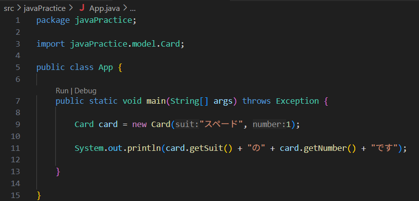

# ②カードクラスをつくる - ②カードは複数枚必要

## 課題１ カードのクラス定義とインスタンス化 解答

### ①クラスを作成

### ②Cardクラスからインスタンスを作成

|||
|---|---|
|||

### ③アクセサを使用してコンソール表示

|||
|---|---|
|||
|||

## （閑話）セッターはいらない？

今回、あえてセッターは作成しませんでした  

セッターがあるということは、インスタンスを作成した後に  
中身の属性を書き換える余地があるということです  
ただ、現実のトランプを考えたときに、それは良いことなのでしょうか

要は、引いたカードの内容が後から書き換わるということ  
マジックでもない限り、あり得ないですよね  
(マジックだとしても、書き換わっている”ようにみえる”だけですが)  
現実世界をオブジェクトの落とし込んでいるわけですから  
現実であり得ないことは実装しない方が無難です  
(不用意に使用されてしまうことで、バグの原因にもなりますしね)

ちなみに、引数有コンストラクタによる初期化も同様の理由です  
この場合は、一瞬でもスートや数値が描かれていないカードが存在していいのか  
という問いかけに変わります

## （休題）複数枚のカードを作る

Cardクラスをnewすることで、一枚一枚のカードを作ることができるようになりました  
ただし、トランプはたった一枚あっても役に立ちません  
山札としてすべてそろっているからゲームに使うことができます  

そこで、例えばスペードの1~13のカードを作ってみましょう...  
と課題を出されたらどうしましょう

がぞう

このように記述することで、一応はすべてのトランプを作ることはできそうですが...  

  * めんどくさい（13回も書くの？）
  * つかいにくそう（13個も変数宣言するの？）

と思いませんか？（思ったということにしてください）　　

ということは、次のようなことができれば、もっとすっきり書くことができそうです  
そして当然その機能はjavaに存在しています

  * 同じような操作を繰り返す機能 → forループを使用する
  * 同じようなデータを複数個持つことができるような機能 → リストを使用する

次のページからそれぞれ学んでいきましょう。

[次のページ](./02_03.md)
