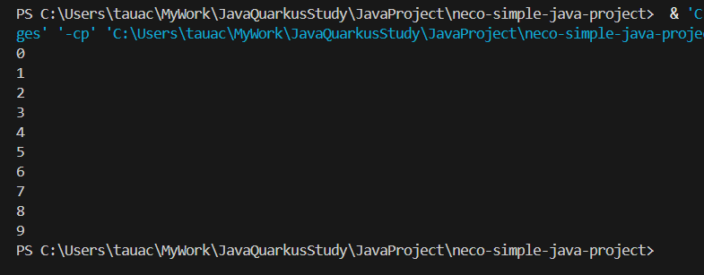

# ③繰り返しの処理(基礎)

## 繰り返し処理

繰り返し処理には for文 を使用します  
for文 使用することで、指定した回数同じ処理を行うことができます

### 記述例と構文説明

```
    for(int i = 0 ; i < 10 ; i++){
        System.out.println(i)
    }
```

このように記述することで、{}の中身の処理を複数回処理します  


(int i = 0 ; i < 10 ; i++) は、それぞれ  
(一番初めに行われる処理 ; ループの継続条件 ; １ループ終了毎に行われる処理)  


を現しており、日本語で記述するのであれば.....

  * 一番初めに 整数 0 を定義し、ループ処理が終わるごとに +1 する
    * 「i++」は i = i + 1 という意味です
  * 上記の値が10未満の場合に、ループ処理を継続する

となり、計10回、{}の中身の処理が行われることになります。(iは0~9を遷移)  
したがって、n回処理を繰り返したい場合は、上記の「10」を変えれば良いというわけです


上記の処理を実行してみると、このようになります



ループの条件用の変数として使用している i も繰り返しの処理に使用できます


## 課題２ 繰り返し処理の練習

  * 1 ~ 10 までの整数を順番に加算し、その合計を表示してください

[次のページ](./02_04.md)
