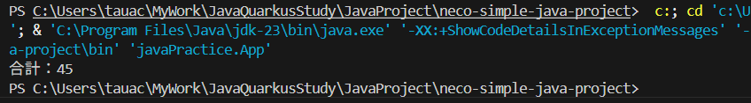
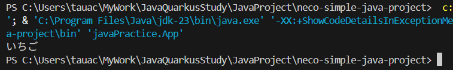

# ④リストを使った処理

## 課題２ 繰り返し処理の練習 解答

```
    int sum = 0;

    for (int i = 0; i < 10; i++) {
        sum += i; // sum = sum + i という意味です
    }

    System.out.println("合計：" + sum);
```




## リスト

リストを使用することで、同じ型の変数を複数管理することができます  
似たものに、配列と呼ばれるものがありますが、Javaではあまり使いません  
(位置指定で取得したり、削除したり、挿入したりしにくい)

### 記述例と構文説明
#### リストの宣言

```
    List<String> fruits = new ArrayList<>(); 
```

このように記述することで、String型の変数を格納するリスト fruits が作られます  
（いわずもがな、fruit もリスト型の"変数"です）  
`<String>`の箇所は、リストの用途に応じて任意の型を設定しましょう  
当然ですが、まだ宣言しただけなので中には何も入っていません

#### リストへの要素の追加

```
    fruits.add("りんご");
    fruits.add("いちご");
    fruits.add("みかん");
```

上記のように、addメソッドを使用することで要素を追加することができます  
リスト宣言時、`List<String>`と記述したので、String型の要素しか入りません  
また、このときaddした順番で、各要素には番号（インデックス）が振られます

```
  (採番のイメージ)
    0:"りんご"
    1:"いちご"
    2:"みかん"
```

#### リスト内の要素の取得 / 削除

```
    String a = fruits.get(1);
```

このように記述することで、fruits内の要素を取得することができます  
指定する番号は、addしたときに振られたインデックスです  
つまり、この変数を出力すると......



1番目のくだもの「いちご」が出力されましたね

```
    fruits.remove(1);
```

同様に、インデックスを指定することで特定の要素を削除することもできます  

#### その他の操作について

リストの宣言・追加・取得・削除の基本的な操作を説明しました  
ただ、使用可能な機能は他にも複数存在します  
たとえば...

  * 特定の要素が存在するか確認したい
  * リストの中身を一気に削除したい
  * 番号じゃなくて、文字列使って検索したい

こんな時はぜひ、公式リファレンスを参考にしてみてください  
少し難しいですが、思いもよらぬ使い方が見つかるかもしれません  
(勉強会中はもちろん聞いてくれて大丈夫)

[Listの公式リファレンス](https://docs.oracle.com/javase/jp/8/docs/api/java/util/List.html)


## 課題３ リストの練習

  * ①以下の条件でリストを作り、要素を追加してみましょう
    * Card 型のリスト Cards
    * 追加する要素は以下の通り
      * 「スペードの１」
      * 「ハートの１」
      * 「ダイヤの１」
      * 「クローバーの１」
  * ②「ダイヤの１」をリストから取得し、画面に表示しましょう
  * ③（応用）繰り返し処理を利用して、上記すべての要素を画面に表示しましょう

