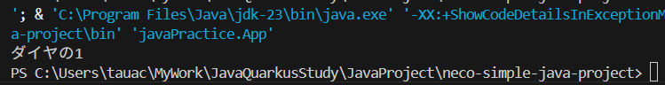
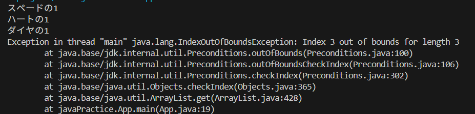

# ⑤繰り返し処理とリストを組み合わせる

## 課題３ リストの練習 解答

### ①リストの作成と要素の追加

```
    // リストの宣言
    List<Card> cards = new ArrayList<>();

    // リストに要素を追加
    cards.add(new Card("スペード", 1));
    cards.add(new Card("ハート", 1));
    cards.add(new Card("ダイヤ", 1));
    cards.add(new Card("クローバー", 1));
```

### ②要素の取得

```
    Card card = cards.get(2);
    System.out.println(card.getSuit() + "の" + card.getNumber());
```




### ③（応用）すべての要素の取得・表示

```
    for (int i = 0; i < 4; i++) {
        Card card = cards.get(i);
        System.out.println(card.getSuit() + "の" + card.getNumber());
    }
```


## 繰り返し処理とリストを組み合わせる

### リストのサイズを取得して使用する

課題３-③のfor文の条件指定は、4回処理を繰り返すためのものですが  
リストの要素がそれよりも少なかったらどうでしょう  

```
    List<Card> cards = new ArrayList<>();

    cards.add(new Card("スペード", 1));
    cards.add(new Card("ハート", 1));
    cards.add(new Card("ダイヤ", 1));

    for (int i = 0; i < 4; i++) {
        Card card = cards.get(i);
        System.out.println(card.getSuit() + "の" + card.getNumber());
    }
```



```
java.lang.IndexOutOfBoundsException: Index 3 out of bounds for length 3
```

おや、エラーが出てしまいました  
length（リストの大きさ・要素数）が 3 なのに、  
3 番目のインデックスを指定してしまっている...と怒られてしまったようです  
  
あれ、大きさが 3 の時に 3 番目がダメなの？  
そう、インデックスは 0 番目から始まるから、0, 1, 2 しか選べないんです  
  
と、いうことは要素数が減ったら繰り返し条件も変える必要がありそうです  
リストの要素数が増えた場合も同様ですね  

でもそれって、ちょっと面倒じゃありませんか  
また、要素数がわからないときはどうすればいいんでしょうか  
というときに使える方法があります

```
    for (int i = 0; i < cards.size(); i++) {
        Card card = cards.get(i);
        System.out.println(card.getSuit() + "の" + card.getNumber());
    }
```

size()は、リストの現在の要素数を返すメソッドです  
これを使えば要素がいくつであろうと、その数だけ処理することができそうです  
(i の値は 0 ~ 要素数-1 を遷移します)

### リストそのものを繰り返しの条件に使用する（拡張for文）

上記の方法は、リストのサイズを取得して繰り返しの条件とし、  
繰り返し処理の中で、各要素をgetしていますが、これは...  
  
「リストの大きさはこれくらいだから、サイズの数だけ順番に数数えて」  
「繰り返しごとに、今の番号の位置の要素取り出して表示して」  
  
と指示するイメージに近いと思います  
ただ、もっと雑に...  
  
「リスト渡すから、それ順番に取り出して表示してよ」  
  
と指示することはできないでしょうか  
プログラマーは怠惰なので、より直観的で楽な書き方を目指そうとします  
その結果が以下の記述です

```
    for (Card card : cards) {
        System.out.println(card.getSuit() + "の" + card.getNumber());
    }
```

条件を(Card card : cards)という記述に変えることで  
Card型の変数cardにリストcardsの要素が順番に代入され    
結果として、課題３-③と同じ出力を得ることができます  
  
このような記述方法を「拡張for文」と呼びます  

好みにもよるかもしれませんが、両者を比較したときに  
「リストの要素を順番に取り出して操作している」  
と理解しやすい（読みやすい）のはどちらなのか、考えてみるのも楽しいかもしれません

```
    for (int i = 0; i < cards.size(); i++) 

        VS

    for (Card card : cards) 
```
  
まぁ、拡張for文にも問題はあるんですが...  
（どこかのタイミングで説明するかも）  

## 課題４ すべてのカードをつくる（繰り返し処理＋リスト）

  * ①全52種類のカードを持つリストを作りましょう
  * ②拡張for文を使用して、全部のカードを表示しましょう

