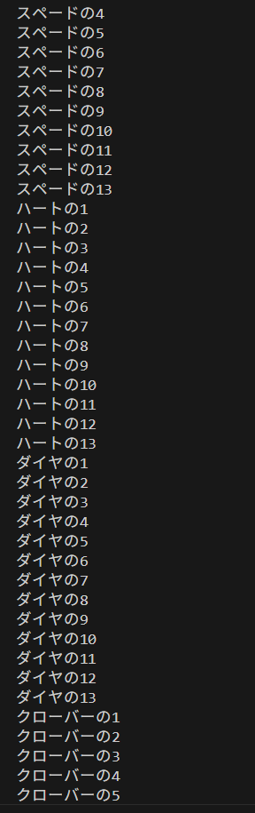

# ⑥スートから学ぶ文字列表現の危うさ

## 課題４ すべてのカードをつくる 解答

### ①全52種類のカードを持つリスト作成

```
    List<Card> cards = new ArrayList<>();

    // 52枚定義
    for (int i = 1; i <= 13; i++) {
        cards.add(new Card("スペード", i));
    }
    for (int i = 1; i <= 13; i++) {
        cards.add(new Card("ハート", i));
    }
    for (int i = 1; i <= 13; i++) {
        cards.add(new Card("ダイヤ", i));
    }
    for (int i = 1; i <= 13; i++) {
        cards.add(new Card("クローバー", i));
    }
```

条件を（i = 0 ; i < 13）ではなく（i = 1 ; i <= 13）とすることで  
i を 0~12 ではなく 1~13 の間で遷移させることができます  
前者の条件のまま、i+1 を初期化の値として入れても大丈夫です

### ②拡張for文を使用したカードの表示

```
    // 全カード表示
    for (Card card : cards) {
        System.out.println(card.getSuit() + "の" + card.getNumber());
    }
```



※実行例は長いので一部抜粋

## スートの定義の曖昧さ

課題４-①の回答について、どう思いましたか？  
(という変な進め方にもちょっと慣れてきたころかもしれませんね)  
  
考えてみましょう  
  
今からあなたは、仲間数人とトランプゲームのプログラムを作ります  
トランプゲームは多岐にわたりますから、ゲームごとに分担するとして  
オブジェクト指向の考え方に従い、保守性を高めるために  
この Card クラスは皆共通して使うことにしました。  
  
そこでババ抜きのチームと、大富豪のチームが生まれたとして  
52枚のカードを用意するという操作はどちらも行うはずです  
さて、両チームともに、同じカードが同じ順番で生まれるでしょうか  
あるいはそもそも、ルールにのっとったカードを作れるでしょうか  

```
スペードは「スペード」と「SPADE」どっち？ 
  
「うーん英語表記にすることにしよう」  
  
ならダイヤは「DIA」「DIAMOND」どっち？

「短い方で」

なんかちゃんと動きません～

「スペルミスあるよ！クラブはCLUB！CLABじゃない！」

STARってスートのカード作ってみました

「なんでそんなことするの？」
```

と、ここまでのことにはそうそうならないとは思いますが...  
String型の定義には、表記ゆれはつきものです  
設計書を整えて、皆がそれを参照すれば解決する話ではありますが  
ここはいっちょ、クラスの設計を変えてみましょう  
  
上記の例には３つの問題がありました
  * スートの表示名や命名規則を統一しにくい
  * オリジナルのスートを勝手に作れてしまう
  * リスト内のスートの順番も、実装者の匙加減

この中だと、スートの順番については割とどうでもいいんですが  
まぁそれも一緒にどうにかするとして...  
  
Cardクラスをチーム間で共有したように、スートも共有できないでしょうか  
こう、決まった表記で、決まった順番に列挙されているような  
  
という要望を解決するのが、列挙型(Enum)と呼ばれるものです  