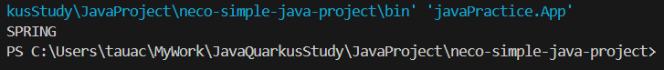

# ⑦列挙型Enumについて

## 列挙型Enum

カードのスートのように、特定の種類以外は存在しえないような概念  
そういったものを定義するのが列挙型Enumです（以下Enum）  
  
実例を挙げるとすると、注文の状態などでしょうか  
  
「支払待」「在庫不足」「発送可能」「発送済」「配送完了」  
  
我々も注文をした後に発送状況など確認すると思いますが  
おそらくそこの表記も、Enumと似た概念で実装されているはずです 
   
発送状況：「盆踊り中」とか適当な状態書かれてたらウケますね  

### 記述例と構文説明
#### Enumの定義

```
    public enum SeasonEnum {

        SPRING, SUMMER, AUTUMN, WINTER;

    }
```

上記は四季をEnumとして記述した例です  
四季も、日本では春夏秋冬の４つしかありませんよね  
  
Enumを定義するときは、クラスを定義するときと同様javaファイルを作ります  
そのうえで、クラスであれば「public class クラス名」となるところを  
「public enum Enum名」としてあげます  
  
中身は、Enumで定義したい要素をカンマ区切りで列挙します  
全部大文字なのは慣習です  
  
慣習ついでに...  
上の記述例では要素を横一列に並べていますが  
(カンマ区切り・行末の；の必要性を強調しています)  
  
過去に僕がいた案件では、下記のように縦に並べる様に列挙してました  

```
    public enum SeasonEnum {

        SPRING, 
        SUMMER, 
        AUTUMN, 
        WINTER;

    }
```

#### Enumの宣言

```
    SeasonEnum season = SeasonEnum.SPRING;
```

Enum型の変数を宣言するときは、上記のようにEnum名と要素をつなぎます  
メソッド呼び出しの時に使っている、ドット演算子の考え方と同じです  
要は「SeasonEnumという列挙型のなかのSPRINGという要素」と言う意味です  
  
つぎに、宣言したEnumを出力してみるとどうなるのでしょうか  


```
    System.out.pringln(season)
```



このように、定義したEnumの要素がそのまま表示されます  
当たり前っちゃ当たり前...な気がしますね  
  
それでは...  
「画面に出力する文字列は日本語がいい」  
と言われたらどのように実装しましょうか  
  
Enumの要素名を日本語にする...は、ちょっとナシにしましょう 
（できるけど）  
   
Enumの要素名はそのままに、表示名を変える  
それを実現させるために、次の記述を加えます

#### Enumの各要素に属性を持たせる

```
    public enum SeasonEnum {

        SPRING("春"),
        SUMMER("夏"),
        AUTUMN("秋"),
        WINTER("冬");

        String jpnName;

        private SeasonEnum(String jpnName) {
            this.jpnName = jpnName;
        }

        public String getJpnName() {
            return this.jpnName;
        }
    }
```

急にドカッと記述が増えました  
頭が痛くなってきたかもしれませんが、少しだけ辛抱を  
もしかしたら、ところどころ知っている概念があるかもしれません  
  
まず、Enumの各要素の後ろに()がついて、中に日本語名が入っています  
そして、Enumの要素とは別にjpnNameなる変数が増えていて...  
なんかメソッドも新しく２つ作られています  

わかりやすいところからいきましょう  
jpnNameという変数が急に生まれたことを仮に受け入れるとして  
した二つのメソッドは、コンストラクタと、アクセサ（ゲッター）  
に見えませんか？  

見えませんか？というか、ズバリそのものなんですが  
  
```
    public enum SeasonEnum {

        SPRING("春"),
        SUMMER("夏"),
        AUTUMN("秋"),
        WINTER("冬");

        String jpnName;

        // コンストラクタ
        // ただし、可視性はprivate
        private SeasonEnum(String jpnName) {
            this.jpnName = jpnName;
        }

        // ゲッター
        public String getJpnName() {
            return this.jpnName;
        }
    }
```

変数が生まれた意味は置いておいて...  
「属性を持たせたくなったら、コンストラクタとゲッターは実装する!」  
そういう決め事と一旦とらえておきましょう。  
そして、決め事ついでに、「Enumのコンストラクタの可視性はprivate」です  
  
さて、残った謎は「jpnName」なる変数が生まれた理由です  
  
そもそも、今の変更を加えることになった理由は  
「英名ではなく和名表示をしたい」からでした  
  
つまり...  
  
SPRINGに、自身の名前（英）のほかに”春”という名前（和）を持たせたい  
SUMMERに、自身の名前（英）のほかに”夏”という名前（和）を持たせたい  
AUTUMNに、自身の名前（英）のほかに”秋”という名前（和）を持たせたい  
WINTERに、自身の名前（英）のほかに”冬”という名前（和）を持たせたい  
  
ということです  
ところで、これらの”春”,”夏”,”秋”,”冬”は、データ型で表すとしたらなんでしょう  
そして、jpnNameは何型で定義されているでしょうか  
  
なんとなーく、わかってきた気がしませんか  
ここで、情報を増やしてみましょう  
  
「春夏秋冬に1-4の順番を持たせたい」  
  
こうした場合、どういう記述に変わるでしょうか  

```
    public enum SeasonEnum {

        SPRING("春", 1), ......①
        SUMMER("夏", 2),
        AUTUMN("秋", 3),
        WINTER("冬", 4);

        String jpnName; ......②
        int number;

        // コンストラクタ ......③
        private SeasonEnum(String jpnName, int number) {
            this.jpnName = jpnName;
            this.number = number;
        }

        /* アクセサは記載省略 */ ......④

    }
```

このようになります  
  
つまり、Enumの各要素に情報を付け足したくなった場合は  
  * ①Enumの各要素の後ろに()をつけて、与えたい情報を記載する
  * ②与えた情報と同じ型の変数を属性として定義する
  * ③定義した変数を持つ引数有コンストラクタを定義する
    * ただし可視性はprivate
  * ④必要に応じて変数のアクセサを用意する
  
長かったですね......  
Enumは慣れてしまえば使いやすいものの、ハードルの高い概念だと思います  
一度ですべて覚えきろうとせず、逐一戻りながら実装してみましょう  
何度も言いますが、勉強会中であれば聞いてもらって構いません  

## 課題５ Enumでスートを定義する

  * ①Enumでスートを定義してみましょう
    * Enum名：SuitEnum
    * 各スートの英字表記
      * SPADE
      * HEART
      * DIA
      * CLUB
  * ②Enumの各要素に、和名の属性を追加しましょう
    * スペード
    * ハート
    * ダイヤ
    * クラブ
  * ③いずれかのEnumを変数として宣言し、和名で出力させてみましょう