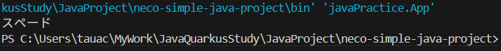

# ⑧カードクラスを完成させる

## 課題５ Enumでスートを定義する

### ①Enumでスートを定義

```
    public enum SuitEnum {

        SPADE,
        HEART,
        DIA,
        CLUB;

    }
```

### ②和名の属性を追加

```
    public enum SuitEnum {

        SPADE("スペード"),
        HEART("ハート"),
        DIA("ダイヤ"),
        CLUB("クラブ");

        String name;

        /* コンストラクタ */
        private SuitEnum(String name) {
            this.name = name;
        }

        /* アクセサ */
        public String getName() {
            return this.name;
        }

    }
```

### ③和名で出力

```
    SuitEnum suit = SuitEnum.SPADE;
    System.out.println(suit.getName());
```




## カードクラスを完成させる

最後に、作ったEnumのスートと、カードクラスを組み合わせてみましょう  
そうすれば、晴れてカードクラスが完成します！  
  
これまでスートをStringで扱ってきた箇所を  
すべてEnumのスートに置き換えて行きましょう！  

## 課題６ カードクラスを完成させる

  * ①Cardクラスを修正しましょう
    * スートの型
    * コンストラクタの引数
    * アクセサの戻り値の型
  * ②全52枚のカードを作成しましょう
    * うまく作れば、forループは２つで済みます
      * Enum名.values() で、対象のEnumのすべての要素が入ったリストが取得できます
      * forループの中でforループを使うこともできます
  * ③全カードを和名表示してみましょう

