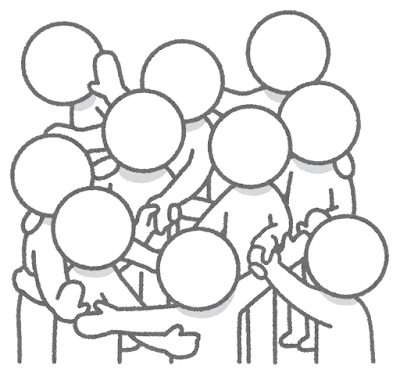
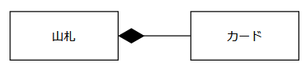

# ①カードクラスとの関係性

## 関係には種類がある

これまで、車や人や本やカードなど様々なオブジェクトを作ってきましたが  
思えば単独のクラスしか作ったことがありませんでした  
  
当然、実際の案件の世界では複数のオブジェクトが存在し  
それらが互いに関係しあって一つのシステムを作ることがほとんどです  
もちろんこれは、ブラックジャックの世界にも当てはまりますね  
  
初回にブラックジャックの世界に存在するオブジェクトを考えてみましたが
そこに出てきたオブジェクト同士が全くの無関係である...  
なんてことはないはずです 

  
オブジェクト指向における関係性とはどのようなものか  
という問いの答え自体は難しそうでいて、とてもシンプルです  
現実世界で互いに関係があるモノ同士であれば  
オブジェクト指向の世界においても関連を持ちます  
  
例えば...

* ①会社と社員（社員は会社に所属している）
* ②動物と猫（猫は動物をより詳細化した概念）
* ③車とタイヤ（タイヤは車の一部）
  
ではここでもう一つ考えてみましょう  
カードと山札と関係性が同じものはどれでしょうか  
  
そう、③の関係が一番近そうです  
カードは山札の一部、と考えることができますからね  
  
ここで大切なことは、一言で「関係がある」と言っても  
その「関係」には種類があるということです  
オブジェクト指向の世界では「関連」と呼びますが  
その種類には以下のようなものがあります

  * 依存
  * 継承
  * 実現/実装
  * 構成/集約

山札クラスを作る前に、これらの概念を学んでおきましょう  
(全てをさらう時間はなさそうですが...)

## クラス図における関連の表現

これまでも何度が紹介したことがあるかもしれませんが  
ここでは「クラス図」を用いて関連に対する理解を深めていきましょう  
  
と、言ってもここら辺の概念はいちから資料を作るより  
外部サイトを参照した方が早いです、ホントに

[オージス総研のサイト](https://www.ogis-ri.co.jp/otc/swec/process/am-res/am/artifacts/classDiagram.html)
[もっとわかりやすい方](https://cacoo.com/ja/blog/how-to-write-class-diagram/)

## 山札とカードの関連と、実装方法

上記を学んだうえでもう一度考えると、
カードは山札の「コンポジション」ということになりそうです  
図示するならば以下の通り  

これで、山札とカードの関係性がわかりました  
めでたしめでたし......  
    
とはなりませんね  
  
これはあくまで設計であり、ここからjavaの世界に落とし込む必要があります  
つまり次の問題は...

「コンポジションはjava上でどのように実装すればよいのか」
  
と、いうことになりますね

## 課題７ 山札クラスの定義

でも実は、今持っている知識だけでクラス作れちゃうんです  
というわけで、間違ってもいいので手を動かしてみましょう！

  * ①以下の条件でクラスを作成する
    * クラス名は「Deck」
    * 属性を考えて、記述してみる
  * ②（応用）コンストラクタを実装する
    * 何を行う必要がありそうか
  * ③（応用）以下のメソッドを実装する
    * 山札に存在する全てのカードを表示するメソッド
    * 山札を初めの状態に戻すメソッド

ヒント
  * 「カードが山札の一部である」を言い換えると  
  「山札は全て（あるいは複数）のカードを持つ」ということができそう
  * コンストラクタで行うのは基本的に初期化。デッキの状態の初期化って何だろう

