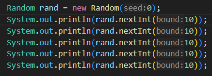
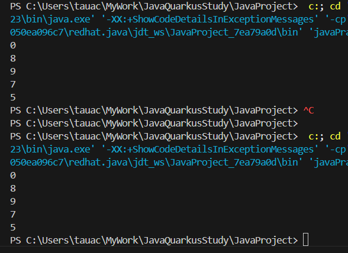

# ③乱数の生成

## 乱数

ランダムに生成される数値を乱数と呼びます  
javaで乱数を発生させるには Random クラスを使用します

### 記述例と構文説明

```
  Random rand = new Random();
  int num = rand.nextInt(10);
```

このように記述することで  
numには、0~9までの数値がランダムで入ります  
  
一行目は乱数生成のために必要なクラスのインスタンスを生成しています  
つまりはおまじないですね(仕様はもちろんあるので、リファレンス参照)  
二行目で実際に乱数生成をしています  
nextIntメソッドの引数に応じた乱数を返す仕組みになっています  
  
[Randomクラスの公式リファレンス](https://docs.oracle.com/javase/jp/8/docs/api/java/util/Random.html)

#### 疑似乱数

あまり意識しなくてもよい仕組みではあるんですが、一応ご紹介  
（業務で乱数を使うことはほとんどないでしょうしね）
  
実は、完全にランダムな（予測不能な）数値発生させることはできません  
いや、じゃあ上のコードは何なのよ...という話になりそうですが  
上記の例もあくまで、ランダムで数値を発生させている「ようにみえる」だけです
  
乱数を発生させる際に必要な概念として「シード」と呼ばれるものがあります  
文字通り、乱数を生み出す「種」です  
同じ種からは同じ植物が発芽するように、同じシードからは同じ乱数が生まれます  




インスタンス生成時に設定している引数がまさにシードです  
「0」が指定されていますが、この状態で二度実行すると...  



全く同じ値が生成されていますね  
このような乱数を「疑似乱数」と呼びます  
  
ちなみに、記述例では引数無しでRandomのインスタンスを生成していますが  
この場合引数無しコンストラクタの中で、自動的にシードを設定しています  
PC内部の時間などを使って、呼び出されるたびに別のシードが設定されるようです  
便利ですねぇ...


## 課題８ ドローメソッドの作成

  * drawメソッドを作成する
    * デッキ内のカードをランダムで一枚引き、呼出元へ返す
    * 引いたカードはデッキから削除すること
    * Deckクラス内に作成すること
