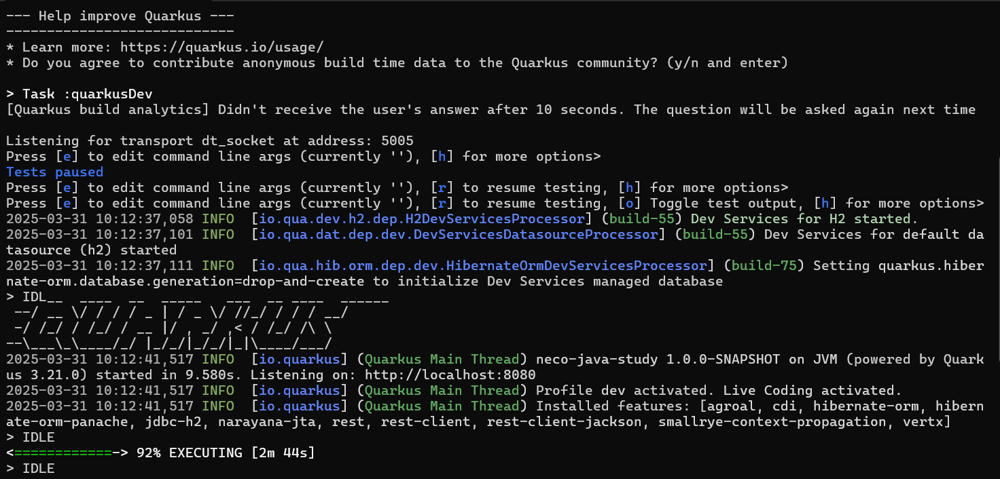

# Quarkusプロジェクト作成

```{caution}
いろいろ試しながら、現在実装中です。
```

## 前提

- 

## 作業概要

- プロジェクト新規作成記録
- ビルド方法
- GitIgnore設定

## 作業詳細

### プロジェクト新規作成記録

* 公式サイトを利用する。CLIでの作成も可能なようだけどわからない。
  * [公式のプロジェクト作成用サイトリンク](https://code.quarkus.io/)
  * 会社で使うときもこっから作ってたし、よほど詳細な設定をしたくならない限りはここで良さそう。

```{attention}
下記の設定内容は今あいまい
```

* 設定内容
  * プロジェクト名
    * neco-java-study
  * ビルドツール
    * gradlew：なんかmavenは使いたくない。ビルド設定もjavaの世界で記述できたはず。
  * 選択する機能
    * Rest：RestAPI使うための設定のはず
    * RestClient：確かウェブ上で起動後の操作ができる設定だったと思う　うわーこれイランかも（追記）
    * HiberaateORM
    * HiberaateORM Panache : DB項目との紐づけのために必要
    * H2のJDBC：H2というDB使うための設定


### ビルド方法

* プロジェクトのルートでコンソールを開き、以下のコマンド実行
```
 gradlew quarkusDev
```

* 起動前に自動でダウンロード処理が走る場合がある。
    * gradlewのbinデータ（主に初回起動時）
    * ライブラリのjarデータ（初回起動・設定更新時）
* 以下のような状態になったら起動成功（Quarkusのマークが出る）



* 停止したい場合はコンソール上で Ctrl+C > Y 入力

* 下記の実行中は下記のページにアクセスすることで、デバッグ等が行える。
```
http://localhost:8080/q/dev/
```

### GitIgnore設定

* 以下はビルド時に作成される項目なので、バージョン管理対象外とする
  * .gradlewフォルダ
  * buildフォルダ