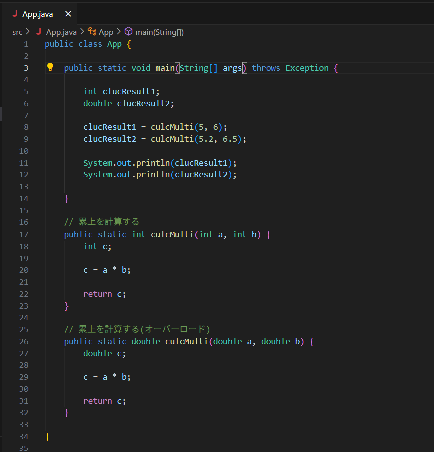

# 第02回（2025/04/13）

## やったこと

  * オブジェクト指向とは
  * クラスの作り方（上記で設計したクラスと対応したものの作り方）

  * (おまけだけど)メソッドの作り方と、引数・戻り値という概念について

## 当日のやり取りや参考資料

* メソッド呼び出し時の引数の型と、メソッドで定義された引数の型の関係について
```
 メソッド定義時の引数の型と、異なる引数の型を入力した場合はエラーとなる。
 同一メソッド名で、異なる引数の型のモノを定義できるということを説明した。
 ここら辺は、「オーバーロード」というワードで調べてもらうとわかりやすいと思う。
```



## その他備忘録

  * 今日の回はなかなか難しかったような気がする。迷ったら前に戻ってやり直す感じで行きたい。
  * 次回は、今回学んだ内容を生かしつつ、テキストに戻る。オブジェクト指向とjavaプログラミングの対応関係って感じかな。
