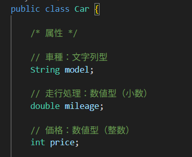
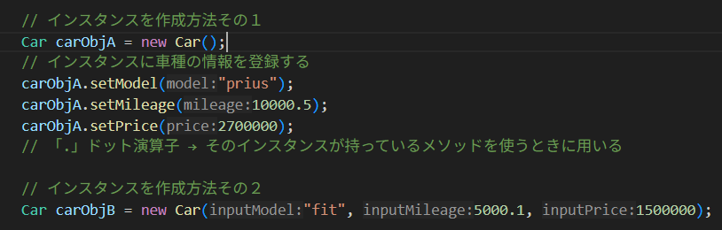
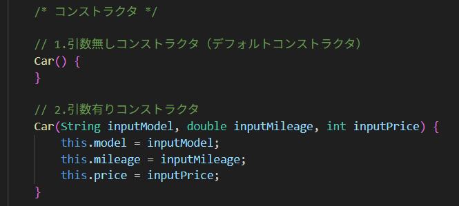
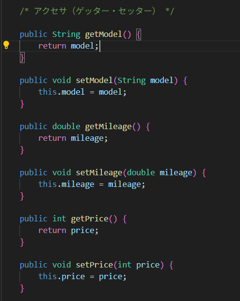
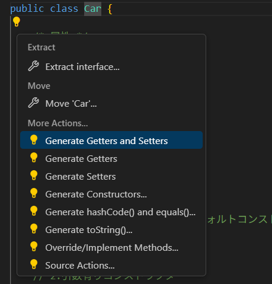

# 第03回（2025/04/26）

## やったこと

  * オブジェクト指向の簡単な復習
  * テキスト「5.クラスの読み方」
  * 実際にクラスを定義して使ってみた
    * クラスの定義
    * コンストラクタの定義
    * アクセサの定義
    * インスタンスの作成

## 当日のやり取りや参考資料

### 今回作成したクラス

  * Carクラス（車）
    * model：車種
    * milage：走行距離
    * price：価格

  * 上記のクラスを雛形として、実際の車インスタンスを作成したい

### インスタンスの作成方法

  * new を使用することで、クラスからインスタンス生成可能
    * このことから、インスタンスを作ることを「newする」と言うことがある。
  * インスタンスを格納する変数の型は、雛形となるクラスを指定する
  * new の後に記述しているものは""コンストラクタ""（次の項目へ）

### コンストラクタの役割と作成方法

  * インスタンス新規作成時に必ず呼び出されるメソッドのこと
  * クラスに定義する
  * 基本的に、クラスに定義されている属性の初期化に使用する

  * ①引数無コンストラクタ
    * 別名デフォルトコンストラクタ
    * 他にコンストラクタを実装していない場合、定義していないくても存在するものとして扱われる
      * まぁ、その場合結局何もしないんだけどね
      * 当然、中身を実装しても構わない
  * ②引数有コンストラクタ
    * 読んで字のごとく、引数が存在するコンストラクタ。自分で実装する必要がある
    * 基本は属性の値の初期化に使用するけど、メソッド内部で計算を行ったり、あるいは初期化しない変数があったりしても構わない
    * 「this」は、「自分が持っている属性の」という指示。結構よく使う

### アクセサについて

  * コンストラクタはあくまでインスタンスの”新規作成”時に属性を初期化するためのメソッド
  * インスタンス作成後に、中身の属性の初期化や更新を行いたいときはアクセサを使用する
  * 別名、ゲッターやセッターと呼ぶ（というかそう呼ぶことの方が多い）

  * 要は、各属性ごとに個別に、単に値を取得したり更新したりするだけのシンプルなメソッド
  * 基本的にはクラスを作ったら必ずアクセサもすべて作らないといけない
    * 属性が100個とかあったらどうする？
    * ご安心ください。いろいろ解決方法あります
      * ①自動生成機能を使用する（下の画像）
      * ②ライブラリを使用する（lombocというライブラリを使用すると、アクセサが存在することにしてくれます。頃合い見て弄ろうね。）

  * ちなみに、コンストラクタも上記の方法で自動生成できる

## その他備忘録

  * 前回と併せて、多少オブジェクト指向的の理解が進んだと思う。
  * 次回からは、簡単なモデルを利用して、オブジェクト指向とアルゴリズムの理解を並行して行う予定。
