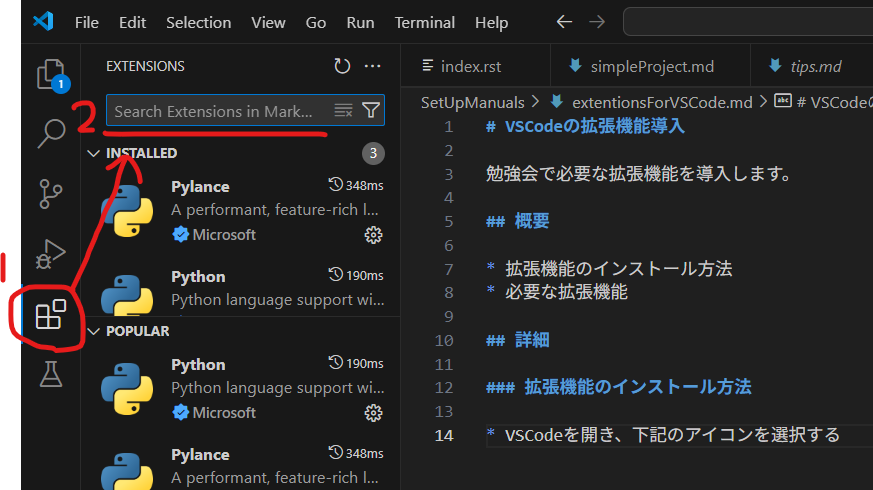
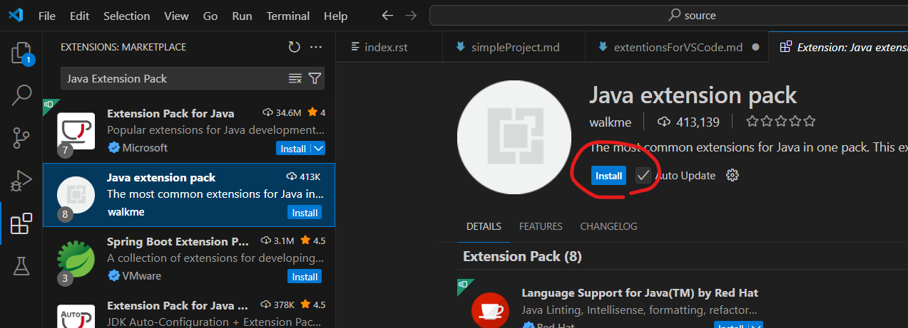

# VSCodeの拡張機能導入

勉強会で必要な拡張機能を導入します。

## 概要

* 拡張機能のインストール方法
* 必要な拡張機能

## 詳細

### 拡張機能のインストール方法

* 1.VSCodeを開き、下記のアイコンを選択する
* 2.インストール予定の拡張機能名を入力し、検索する
* 3.対象の拡張機能を選択肢て、インストールボタン押下
  * 似た名前の拡張機能が多いから注意

|||
|---|---|
|  | |

### 必要な拡張機能

* Java Extension Pack
  * Javaのプロジェクトの作成・実行に必要
