# TortoiseGitの使い方

基本的な操作方法のみ記載します。  
前提として、TortoiseGitが日本語化されている状態とします。  
CLI（コマンドプロンプト上での操作）は記載しません（GUI操作のみ）。

## 操作概要

* クローン/clone
* コミット/commit
* プッシュ/push
* プル/pull

## 操作詳細

### クローン/clone

リモートリポジトリをローカルにコピーする。  
SVNのチェックアウトと同じような意味。

* 1.クローンしたいリポジトリのリンクを取得

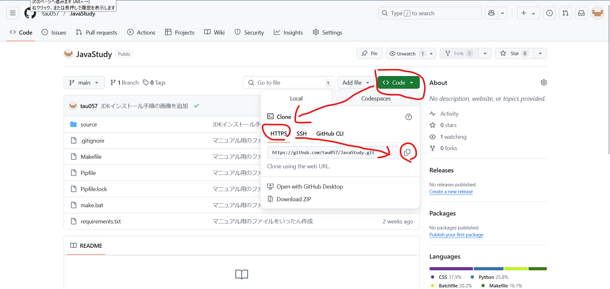

* 2.クローンしたい場所で 右クリック > Git クローン(複製)

| ① | ② |
| --- | --- |
| 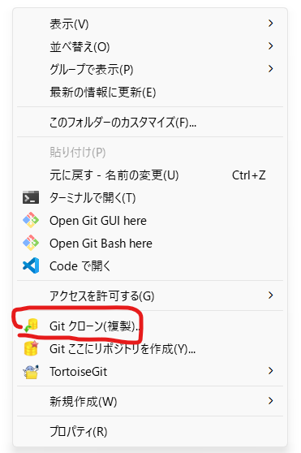 | 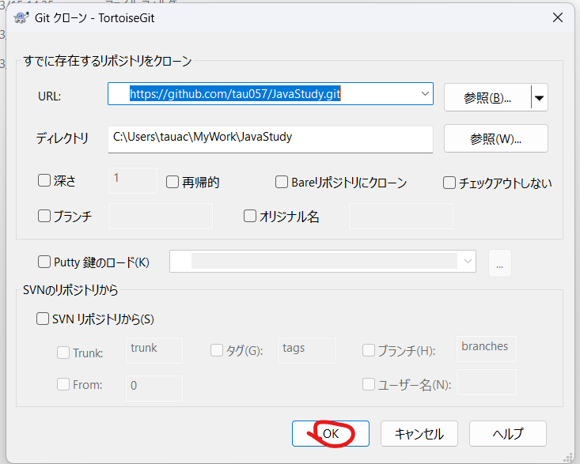 |

### コミット/commit

ローカルリポジトリの修正内容を確定させる。  
この時点ではリモートリポジトリは変更されない。  
ステージングと呼ばれる作業と同時に行うことができる。

* 1.ファイルの修正・追加を行う
  * 変更されたファイルはマークが変わる

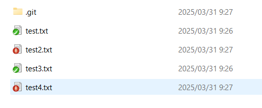

* 2.ローカルリポジトリ内で 右クリック > Git コミット
  * コミット対象となるファイルは個別に選択可能

| ① | ② |
| --- | --- |
| 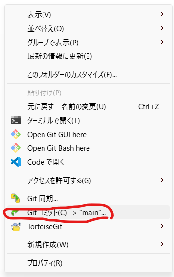 | 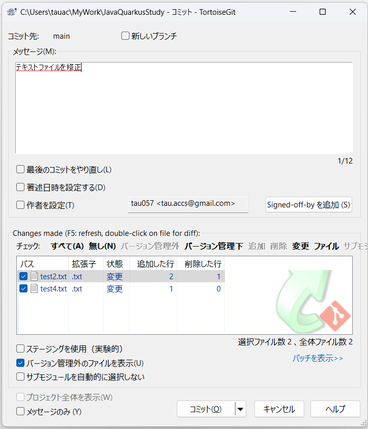 |

* ファイルの修正取り消しについて
  * 右クリック > 変更の取り消し

| ① | ② |
| --- | --- |
| 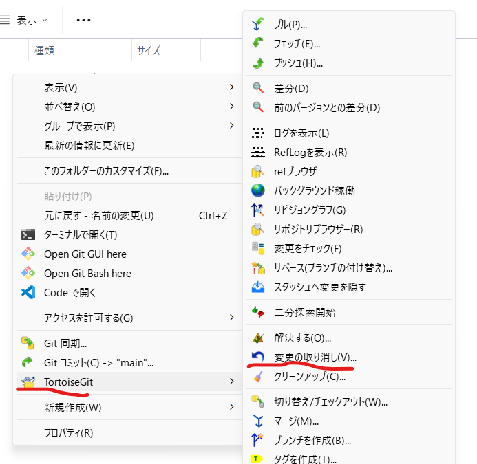 | 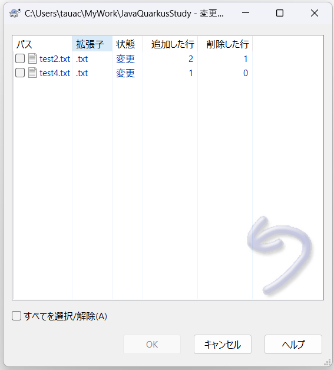 |

### プッシュ/push

ローカルリポジトリの内容をリモートリポジトリに反映させる。  
SVNのコミットと同じような意味。  
ファイルの競合があったり、リモートリポジトリの最新断面をプルしていないと失敗するため注意。

* （前提１）ローカルリポジトリに変更内容をコミットしてある
* （前提２）リモートリポジトリの最新断面がプルしてある
* ローカルリポジトリ内で 右クリック > プッシュ

| ① | ② |
| --- | --- |
| 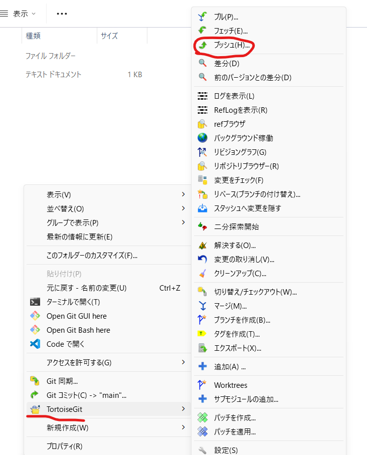 | 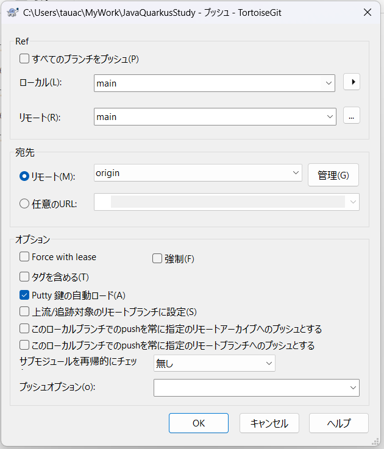 |

### プル/pull

リモートリポジトリの内容をローカルリポジトリに反映させる。
SVNの更新と同じような意味。  
ファイルの競合があると失敗するため注意。

* ローカルリポジトリ内で ①右クリック > ②プル

| ① | ② |
| --- | --- |
| 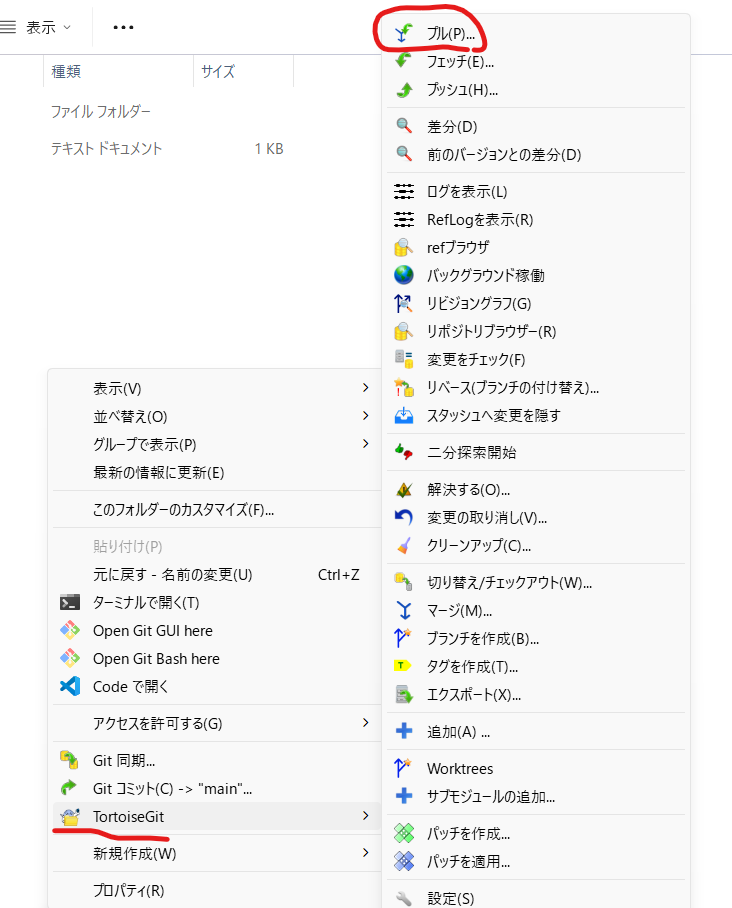 | 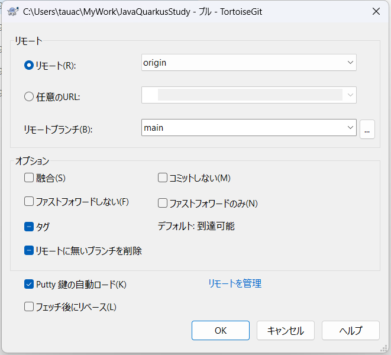 |

